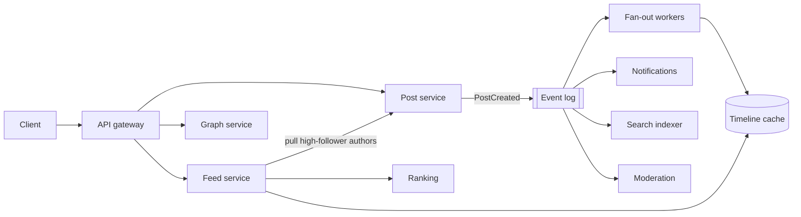

# Social Media Platform — Reference System Design

[](https://github.com/shivkumarsinghsky/social-media-platform/actions/workflows/ci.yml)


A **social media platform** reference system design by **Shiv Kumar**, with a runnable Python prototype of the
hardest part, the home feed: fan-out on write, fan-out on read and the hybrid approach, plus a simulation that
measures the trade-off.

> **Reference system design inspired by publicly known product requirements** of social networks. It is not the
> architecture of any specific company.

## Overview

A social feed is read far more often than it is written, and follower counts are extremely skewed. Pushing posts to
every follower makes reads cheap but turns one post by a popular account into millions of writes. Pulling at read
time makes writes cheap but every read expensive. This repository designs the full platform (users, graph, posts,
engagement, media, feed, notifications, messaging, search, recommendations, moderation, analytics) and implements
the feed core so the trade-off can be measured.

## Architecture



Full design, including capacity, the feed sequence, data model, storage choices and the small-to-internet-scale
evolution: [docs/architecture.md](docs/architecture.md).

## Key Capabilities

| Topic | Design | Prototype |
|---|---|---|
| Users, follow, block | Graph stored as both edge directions | `FollowGraph` with blocks |
| Posts, likes, comments, media | Sharded by post id; media in object storage + CDN | `PostStore` (media as object keys) |
| Feed: fan-out on write / read / hybrid | Hybrid with a follower threshold | All three strategies behind one `FeedService` |
| Timeline cache | Per-user bounded id lists | `TimelineCache` (bounded, idempotent inserts, cold rebuild) |
| Ordering and pagination | Snowflake-style ids, opaque cursors | `IdGenerator`, versioned cursors |
| Ranking | ML ranker over a candidate window | Recency × engagement × affinity scoring |
| Notifications | Aggregated, in-app + push | Aggregation, mentions, push outbox |
| Event-driven processing | Partitioned event log | In-process bus with the same events |
| Moderation | Pre-checks, reports, human review | Term rules, report threshold, review queue |
| Search, recommendations, messaging, analytics | Designed | Not implemented (see [messaging prototype](https://github.com/shivkumarsinghsky/realtime-messaging-platform)) |

## Technology Stack

| Area | Prototype | Production design |
|---|---|---|
| API | Python, FastAPI | Stateless services behind a gateway |
| Timelines | In-memory | Redis-style cluster sharded by user |
| Posts / graph | In-memory | Wide-column or sharded relational stores |
| Events | In-process bus | Kafka-style partitioned log, outbox |
| Media | Object keys only | Object storage + CDN |

## Repository Structure

```text
social-media-platform/
├── src/social/
│   ├── ids.py            # time-ordered 64-bit ids
│   ├── graph.py          # follow graph, blocks
│   ├── posts.py          # posts, likes, comments
│   ├── timeline.py       # timeline cache, fan-out strategies, cursors, ranking
│   ├── notifications.py  # aggregation, mentions
│   ├── moderation.py     # policy checks, reports
│   ├── events.py         # domain events and bus
│   ├── platform.py       # wiring through events
│   ├── simulation.py     # strategy comparison
│   └── api.py            # HTTP API
├── tests/
├── docs/                 # system design, ADRs
└── docker/  docker-compose.yml
```

## Getting Started

```bash
git clone https://github.com/shivkumarsinghsky/social-media-platform.git
cd social-media-platform
python3 -m venv .venv && source .venv/bin/activate
pip install -e ".[dev]"
pytest
python -m social.simulation                       # compare fan-out strategies
python -m social --port 8000 --strategy hybrid    # or: docker compose up -d --build
```

Interactive API docs: <http://localhost:8000/docs>.

Example simulation output (synthetic power-law graph, 5,000 users, threshold 500):

```text
strategy  writes/post avg    max  sources/read avg   max
write              1753.9   4763               1.0     1
read                  0.0      0              23.8    48
hybrid               47.9    491              10.6    21
```

## Configuration

| Flag | Default | Purpose |
|---|---|---|
| `--strategy` | `hybrid` | `write`, `read` or `hybrid` fan-out |
| `--threshold` | `10000` | Follower count from which an author is pulled at read time |
| `--port` | `8000` | HTTP port |

The prototype keeps state in memory and has no secrets to configure.

## API

`X-User` stands in for the subject of a verified access token in this prototype.

| Method and path | Purpose |
|---|---|
| `PUT` / `DELETE /v1/users/{id}/follow` | Follow / unfollow |
| `PUT /v1/users/{id}/block` | Block (removes follows both ways) |
| `GET /v1/users/{id}`, `/v1/users/{id}/posts` | Profile counts, recent posts |
| `POST /v1/posts`, `GET` / `DELETE /v1/posts/{id}` | Create, read, delete posts |
| `PUT` / `DELETE /v1/posts/{id}/like`, `POST /v1/posts/{id}/comments` | Engagement |
| `POST /v1/posts/{id}/report` | Report; hidden after a threshold of distinct reporters |
| `GET /v1/feed?cursor=&limit=&mode=` | Chronological (cursor) or ranked feed |
| `GET /v1/notifications`, `POST /v1/notifications/read` | Notifications |

## Testing

```bash
pytest                 # 16 tests
ruff check . && mypy
```

The tests cover:

- id monotonicity under clock skew;
- identical feeds from all three strategies;
- hybrid write amplification;
- stable cursor pagination while new posts arrive;
- cold-timeline rebuild;
- unfollow, block and delete enforced at read time;
- follow backfill and bounded idempotent timelines;
- ranking;
- notification aggregation and mentions;
- moderation;
- the simulation's trade-off;
- the HTTP API end to end and its error handling.

## Docker

`docker/Dockerfile` runs the API as a non-root user; `docker-compose.yml` exposes it on port 8000.

## Architecture Decisions

| ADR | Decision |
|---|---|
| [ADR-001](docs/decisions/ADR-001-hybrid-fan-out.md) | Hybrid fan-out for the home feed |
| [ADR-002](docs/decisions/ADR-002-time-ordered-ids-and-cursor-pagination.md) | Time-ordered 64-bit ids and cursor pagination |
| [ADR-003](docs/decisions/ADR-003-event-driven-side-effects.md) | Event-driven side effects |
| [ADR-004](docs/decisions/ADR-004-layered-moderation.md) | Layered moderation |

## Scalability Considerations

- **Hybrid fan-out:** bounds both write amplification and read cost; the threshold is tuned from real distributions.
- **Timeline cache:** sharded by user; only active users are cached, and cold timelines are rebuilt on demand.
- **Workers:** stateless services; fan-out workers scale with event-log partitions.
- **Hot content:** sharded counters and request coalescing for viral posts.
- **Evolution:** documented from a single database to multi-region, cell-based deployment.

## Reliability

- **Delivery:** durable event log with idempotent consumers.
- **Graceful degradation:** chronological feed if ranking fails; rebuild by pull if the cache is cold.
- **Source of truth:** stores are the source of truth, so caches can be rebuilt.

## Security

- Authentication, with blocks, deletions and moderation enforced on every read.
- Rate limits and spam detection.
- Signed URLs for private media.
- Deletion propagated by events to caches and indexes.

## Observability

Per-stage feed latency, fan-out lag, consumer lag, cache hit ratio, notification delivery, moderation queue age.

## Future Improvements

Not implemented in the prototype:

- Persistent stores and a Redis timeline cache.
- A Kafka event log.
- Media upload.
- Search and recommendations.
- Private accounts.
- Sharded like counters.
- Learned ranking.

## Related Projects

- [System Design Architecture](https://github.com/shivkumarsinghsky/system-design-architecture) — [photo sharing social design](https://github.com/shivkumarsinghsky/system-design-architecture/blob/main/docs/designs/04-photo-sharing-social.md), [professional network design](https://github.com/shivkumarsinghsky/system-design-architecture/blob/main/docs/designs/03-professional-network.md), capacity model
- [Real-Time Messaging Platform](https://github.com/shivkumarsinghsky/realtime-messaging-platform) — direct messaging, presence, push
- [Video Sharing Platform](https://github.com/shivkumarsinghsky/video-streaming-platform) — media uploads, CDN, counters
- [Event-Driven Platform](https://github.com/shivkumarsinghsky/event-driven-platform) — outbox, idempotent consumers
- [Microservices Patterns](https://github.com/shivkumarsinghsky/microservices-patterns) — patterns used across services

## Author

**Shiv Kumar** — Senior Software Engineer / Software Architect
GitHub: [github.com/shivkumarsinghsky](https://github.com/shivkumarsinghsky)

## License

[MIT](LICENSE)
