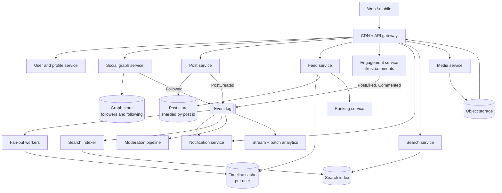
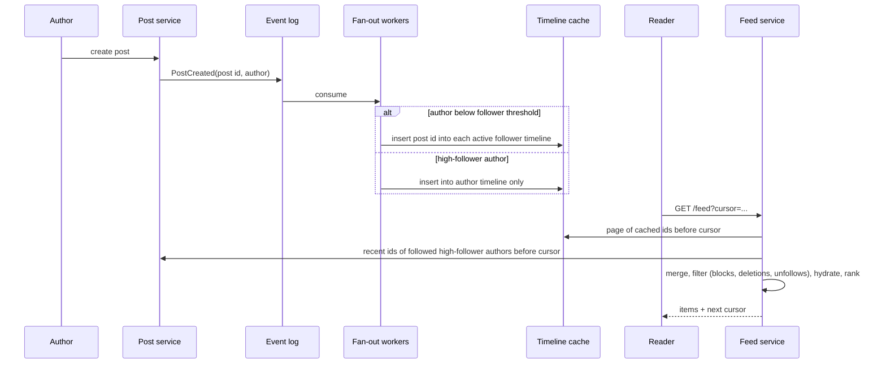
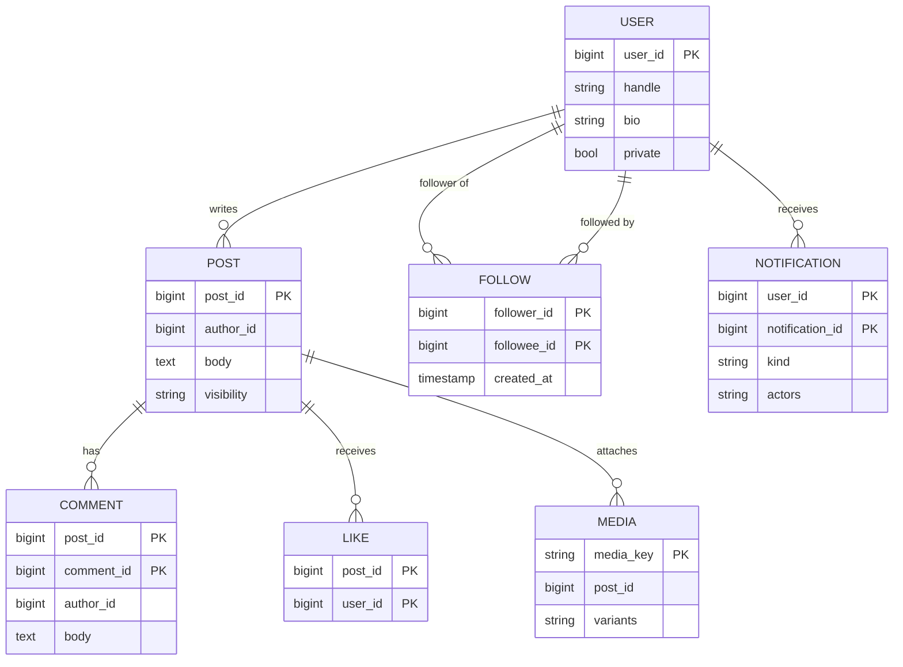

# Social Media Platform — Reference System Design

> Reference system design inspired by publicly known product requirements of social networks. It is not the
> architecture of any specific company; numbers are illustrative assumptions.

**Author:** Shiv Kumar · [GitHub](https://github.com/shivkumarsinghsky)

## Requirements

### Functional

- Users and profiles; follow / unfollow; block.
- Posts with text and media; likes; comments.
- Home feed (chronological and ranked), with infinite scroll.
- Notifications (likes, comments, follows, mentions), in-app and push.
- Direct messaging (see the [messaging platform design](https://github.com/shivkumarsinghsky/realtime-messaging-platform)).
- Search (people, hashtags, posts); recommendations (who to follow, suggested posts).
- Moderation (policy checks, reports, review); analytics for creators and the business.

### Non-functional

| Concern | Target |
|---|---|
| Feed latency | p99 < 300 ms for the first page |
| Post visibility | Followers see a new post within seconds (eventual) |
| Availability | 99.95% for reads; writes may degrade gracefully (queue, retry) |
| Read:write | Read-heavy, ~500:1 |
| Skew | Follower counts follow a power law; some accounts have tens of millions of followers |
| Privacy | Blocks, private accounts and deletions must take effect at read time |

## Capacity Estimation

Using the `photo-sharing` scenario of the capacity model in
[system-design-architecture](https://github.com/shivkumarsinghsky/system-design-architecture)
(200M DAU, 0.1 posts and 50 feed/media reads per user per day):

| Metric | Estimate |
|---|---|
| Write QPS (avg / peak) | ~231/s / ~694/s posts (likes and comments add an order of magnitude) |
| Read QPS (avg / peak) | ~116K/s / ~347K/s |
| New media per day | ~40 TB (original + resized variants) |
| Egress (avg / peak) | ~185 Gbps / ~556 Gbps — served by the CDN |

Fan-out cost: with an average of 200 followers, 231 posts/s become ~46K timeline writes/s with fan-out on write; one
account with 50M followers would generate 50M writes for a single post. That skew drives the feed design.

## High-Level Architecture



## Feed Generation

### Fan-out on write (push)

When a user posts, workers insert the post id into every follower's cached timeline. Reads are a single cache lookup.
Writes scale with follower count, so very popular accounts cause write storms and long delivery delays.

### Fan-out on read (pull)

The feed is assembled at read time by merging recent posts from every followed account. Writes are cheap; every read
touches hundreds of sources, which is expensive at ~100K+ reads/s.

### Hybrid (chosen)

Push for normal accounts; pull for accounts above a follower threshold. Feed read = cached timeline + recent posts
of the few followed high-follower accounts, merged by time-ordered id
([ADR-001](decisions/ADR-001-hybrid-fan-out.md)).



The prototype's simulation (`python -m social.simulation`, synthetic power-law graph, 5,000 users, threshold 500)
shows the shape of the trade-off:

| Strategy | Timeline writes per post (avg / max) | Sources read per feed request (avg / max) |
|---|---|---|
| Write | 1,754 / 4,763 | 1 / 1 |
| Read | 0 / 0 | 23.8 / 48 |
| Hybrid | 47.9 / 491 | 10.6 / 21 |

Numbers come from a small synthetic graph; the threshold is a tuning knob between write amplification and read cost.

### Details that matter

- **Time-ordered ids** (Snowflake-style) make merge-by-id equal to merge-by-time and serve as stable cursors
  ([ADR-002](decisions/ADR-002-time-ordered-ids-and-cursor-pagination.md)).
- **Cursor pagination** (`before=<id>`), never offsets: new posts do not shift pages.
- **Inactive users** have no cached timeline; fan-out skips them and the timeline is rebuilt on their next visit.
- **Read-time filtering** for deletions, blocks, unfollows and moderation, because pushed entries can be stale.
- **Bounded timelines** (for example 800 entries); older pages fall back to pulling.
- **Ranking**: candidates from the merged window, scored by a model (here a simple recency × engagement × affinity
  function), with diversity rules.

## API Design

```http
PUT    /v1/users/{id}/follow            DELETE /v1/users/{id}/follow       PUT /v1/users/{id}/block
POST   /v1/posts                        { text, media_keys }               → 201 { id (string), ... }
DELETE /v1/posts/{id}
PUT    /v1/posts/{id}/like              DELETE /v1/posts/{id}/like
POST   /v1/posts/{id}/comments          POST /v1/posts/{id}/report
GET    /v1/feed?cursor=&limit=&mode=chronological|ranked     → { items, next }
GET    /v1/notifications                POST /v1/notifications/read
```

64-bit ids are serialised as strings so JavaScript clients keep full precision.

## Data Model



| Data | Store | Partitioning |
|---|---|---|
| Users, profiles | Relational (sharded) | `user_id` |
| Follow edges | Wide-column or sharded relational, stored twice (followers, following) | `follower_id` / `followee_id` |
| Posts, comments, likes | Wide-column / sharded relational | `post_id`; author index `(author_id, post_id)` |
| Timelines | In-memory cache (Redis-style lists/sorted sets) | `user_id` |
| Media | Object storage + CDN | Content key |
| Counters | Sharded counters | `post_id` |
| Search | Inverted index | Document id |

## Caching

- Timeline cache (the core of the read path), post hydration cache, user/profile cache, counters cache.
- CDN for media variants and avatars.
- Hot-key protection for viral posts: request coalescing and local in-process caches.

## Event-Driven Processing

Events (`PostCreated`, `PostLiked`, `Commented`, `Followed`, `PostDeleted`) on a partitioned log drive fan-out,
notifications, search indexing, moderation, recommendations features and analytics. Consumers are idempotent (timeline
inserts are set-like; notifications de-duplicate by actor) ([ADR-003](decisions/ADR-003-event-driven-side-effects.md)).

## Notifications

Aggregated per target ("alice and 2 others liked your post"), stored per recipient, delivered in-app and by push for
high-value kinds (comments, mentions). Rate limits and quiet hours on push.

## Search and Recommendations

- Search: posts, people and hashtags indexed from events; ranked by text relevance, freshness and engagement.
- Recommendations: who-to-follow from graph proximity (friends of friends) and interests; suggested posts from
  embedding similarity and engagement, blended into the ranked feed.

## Moderation

Synchronous policy checks before publication (cheap rules, classifiers), asynchronous deeper analysis, user reports
with automatic hiding above a threshold pending human review, and appeals
([ADR-004](decisions/ADR-004-layered-moderation.md)).

## Evolution: Small → Internet Scale

| Stage | Users | Architecture |
|---|---|---|
| Small | < 100K | Monolith + one relational DB; feed by pull query (`WHERE author IN following ORDER BY id DESC`) |
| Growing | ~1M–10M | Read replicas, cache, object storage + CDN for media, background jobs; fan-out on write to a timeline cache |
| Large | ~10M–100M | Services split by domain, event log, sharded stores, hybrid fan-out, search cluster, ranking service |
| Internet scale | 100M+ | Multi-region active-active reads, regional timeline caches, ML ranking and recommendation platform, dedicated graph store, cell-based deployment |

## Scaling

- Stateless services autoscaled; fan-out workers scale with event-log partitions.
- Timeline cache sharded by `user_id`; only active users' timelines are kept.
- Celebrity threshold tuned with data; celebrity posts cached aggressively at the read path.
- Likes on viral posts via sharded counters.

## Reliability

- Event log durable; fan-out and notification consumers retry and are idempotent.
- Feed degrades gracefully: if ranking is slow, serve chronological; if the timeline cache is cold, rebuild by pull.
- Multi-AZ replication of stores; cache loss is recoverable from the source of truth.

## Security and Privacy

- Authenticated APIs; blocks, private accounts and deletions enforced on every read path.
- Rate limiting and spam detection on posting, following and likes.
- Media scanned before distribution; signed URLs for private media.
- Data deletion propagates via events to caches, indexes and analytics stores.

## Observability

Feed latency per stage (cache, pull, hydrate, rank), fan-out lag (post → follower timelines), event-consumer lag,
cache hit ratio, notification delivery rate, moderation queue age.

## Trade-offs

| Decision | Benefit | Cost |
|---|---|---|
| Hybrid fan-out | Bounded write amplification and read cost | Two read paths to merge; threshold tuning |
| Timeline cache of ids only | Small memory footprint | Hydration step on every read |
| Read-time filtering | Correct privacy even with stale timelines | Extra work per read; short pages possible |
| Eventual consistency for feeds and counts | High availability and throughput | Followers see posts with a small delay |
| Cursor pagination | Stable under inserts | No random page access |
